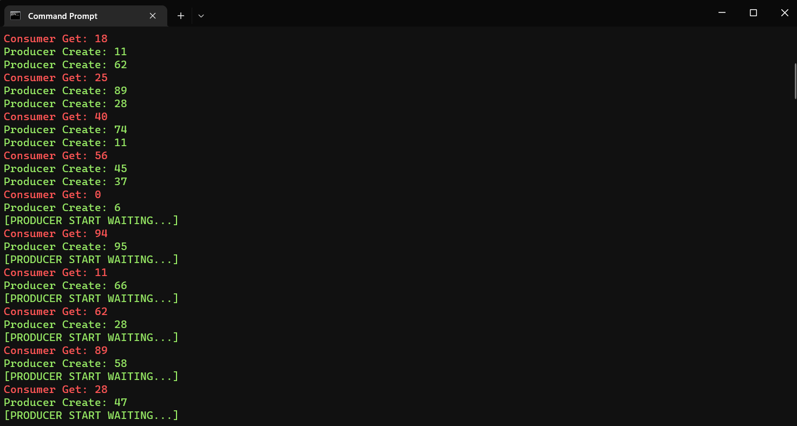

# Consumer-Producer-Golang

    Producer every "half second" produce a number into queue buffer
    Consumer every "one second" get a number from queue buffer

## video demo
https://www.youtube.com/watch?v=-b4R_RwKtwE

## Example Output
